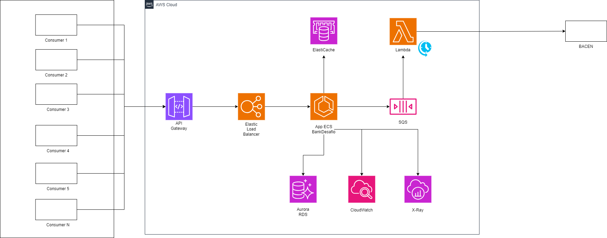

# API Saldo e Transferência

Esta aplicação Spring Boot foi desenvolvida para permitir que os clientes realizem operações de consulta de saldo e transferências entre contas. O sistema foi projetado com foco em resiliência, alta disponibilidade e capacidade para suportar um volume alto de transações por segundo, com latência abaixo de 100ms.

## Tecnologias Utilizadas

- **Spring Boot**: Framework base para o desenvolvimento da aplicação, simplificando a configuração e a publicação de serviços REST.
- **Java**: Linguagem de programação utilizada.
- **Maven**: Ferramenta de gerenciamento de projetos e dependências.
- **MySQL**: Sistema de gerenciamento de banco de dados para persistência de dados.
- **Docker e Docker Compose**: Para conteinerização da aplicação e de suas dependências, facilitando o deploy e a execução em diferentes ambientes.
- **AWS SDK**: Integração com serviços da AWS, como S3 para armazenamento de logs e SQS para enfileiramento de mensagens.
- **Feign**: Cliente HTTP utilizado para comunicação entre serviços, incluindo a integração com a API de cadastro e o BACEN.
- **Spring Cloud OpenFeign**: Integração do Feign com o Spring para chamadas declarativas de APIs REST.
- **LocalStack**: Simulação de serviços da AWS localmente para desenvolvimento e testes.
- **Prometheus e Grafana**: Para monitoramento e observabilidade da aplicação.
- **Spring Data JPA**: Para persistência de dados e interação com o banco de dados MySQL.
- **Hibernate**: Implementação de JPA utilizada para mapeamento objeto-relacional.
- **JUnit e Mockito**: Para testes unitários e de integração.

## Funcionalidades

- **Consulta de Saldo**: Permite que os clientes consultem o saldo atual de suas contas.
- **Transferência entre Contas**: Realização de transferências de valores entre contas correntes, incluindo validações como conta ativa, limite disponível e limite diário de transferências.
- **Notificação ao BACEN**: Após a realização de uma transferência, a aplicação notifica o Banco Central (BACEN) sobre a transação, respeitando limites de rate de chamadas através de enfileiramento de mensagens no SQS e processamento via Lambda quando necessário.

## Arquitetura

A aplicação segue uma arquitetura de microserviços, com serviços autônomos responsáveis por diferentes funções do sistema. A comunicação entre serviços é feita via REST APIs, e o Feign é utilizado para abstrair as chamadas de serviço.



[baixar desenho_da_solucao_drawio](./docs/desenho-solucao-aws-api-saldo-transferencia_V.0.drawio)

# Desenvolvimento e Deploy

Instruções detalhadas para desenvolvimento local, testes e deploy utilizando Docker e Docker Compose.

## Passo 1: Preparação do Ambiente

Clone o repositório do projeto para sua máquina local usando o Git:

```bash
git clone https://github.com/rsdesouza/api-saldo-transferencia.git
cd api-saldo-transferencia
```

## Passo 2: Construção dos Containers com Docker Compose

Na raiz do projeto, onde o arquivo docker-compose.yml está localizado, execute o comando abaixo para construir e iniciar todos os containers definidos no Docker Compose, incluindo LocalStack, Grafana, MockServer e a aplicação:

```bash
docker-compose up --build -d
```

## Passo 3: Inicialização Manual dos Scripts

Após os serviços estarem rodando, você precisará inicializar os ambientes LocalStack e MockServer manualmente.

### Inicializar o LocalStack:
Identifique o ID do container do LocalStack:

```bash
docker ps
```
Execute o script init-localstack.sh dentro do container do LocalStack:
```bash
docker exec -it <ID_DO_CONTAINER> sh /docker-entrypoint-initdb.d/init-localstack.sh
```
### Inicializar o MockServer:
Identifique o ID do container do MockServer e execute:

```bash
docker exec -it <ID_DO_CONTAINER> sh /init-mockserver.sh
```

## Passo 4: Verificação

Verifique se todos os serviços estão funcionando corretamente acessando-os através dos seus respectivos endpoints e portas expostas.

## Passo 5: Desenvolvimento e Testes
Com os serviços rodando, você pode prosseguir com o desenvolvimento e testes da aplicação.

## Passo 6: Desligamento dos Serviços

Para desligar todos os serviços:

```bash
docker-compose down
```
